```{python}
from pathlib import Path
import json
import pandas as pd
import numpy as np

PROJECT_DIR = Path("..").resolve()

adult_results_dirs = sorted(
    [p for p in PROJECT_DIR.glob("regression_results_*") if p.is_dir()],
    key=lambda p: p.stat().st_mtime,
    reverse=True,
)
kids_results_dirs = sorted(
    [p for p in PROJECT_DIR.glob("regression_results_german_kids_*") if p.is_dir()],
    key=lambda p: p.stat().st_mtime,
    reverse=True,
)

def load_json(path: Path) -> dict:
    if not path.exists():
        return {}
    return json.loads(path.read_text(encoding="utf-8"))

adult_dir = None
adult_en = {}
adult_de = {}
for cand in adult_results_dirs:
    en = load_json(cand / "regression_diagnostics_english.json")
    de = load_json(cand / "regression_diagnostics_german.json")
    if en and de:
        adult_dir = cand
        adult_en = en
        adult_de = de
        break

kids_dir = None
kids_diag = {}
for cand in kids_results_dirs:
    kd = load_json(cand / "regression_diagnostics_german_kids.json")
    if kd:
        kids_dir = cand
        kids_diag = kd
        break

summary_rows = []
if adult_en:
    summary_rows.append(
        {
            "dataset": "English adults",
            "analysis_rows": adult_en.get("analysis_rows", np.nan),
            "models_fitted": len(adult_en.get("models_fitted", [])),
            "models_skipped": len(adult_en.get("models_skipped", [])),
        }
    )
if adult_de:
    summary_rows.append(
        {
            "dataset": "German adults",
            "analysis_rows": adult_de.get("analysis_rows", np.nan),
            "models_fitted": len(adult_de.get("models_fitted", [])),
            "models_skipped": len(adult_de.get("models_skipped", [])),
        }
    )
if kids_diag:
    summary_rows.append(
        {
            "dataset": "German kids",
            "analysis_rows": kids_diag.get("analysis_rows", np.nan),
            "models_fitted": len(kids_diag.get("models_fitted", [])),
            "models_skipped": len(kids_diag.get("models_skipped", [])),
        }
    )

diag_summary = pd.DataFrame(summary_rows)
adult_result_stamp = adult_dir.name if adult_dir is not None else "not found"
kids_result_stamp = kids_dir.name if kids_dir is not None else "not found"

_datasets = diag_summary["dataset"].tolist() if "dataset" in diag_summary.columns else []

analysis_rows_english = (
    int(diag_summary.loc[diag_summary["dataset"].eq("English adults"), "analysis_rows"].iloc[0])
    if "English adults" in _datasets
    else "NA"
)
analysis_rows_german = (
    int(diag_summary.loc[diag_summary["dataset"].eq("German adults"), "analysis_rows"].iloc[0])
    if "German adults" in _datasets
    else "NA"
)
analysis_rows_kids = (
    int(diag_summary.loc[diag_summary["dataset"].eq("German kids"), "analysis_rows"].iloc[0])
    if "German kids" in _datasets
    else "NA"
)

disagreement_examples = pd.DataFrame(
    [
        {"language": "English", "model": "Apertus 70B", "word": "zeal", "human": 2.69, "ai": 5.80, "delta": 3.11},
        {"language": "English", "model": "GPT OSS 120B", "word": "mall", "human": 3.82, "ai": 6.80, "delta": 2.98},
        {"language": "English", "model": "OLMo 7B Base", "word": "edifice", "human": 1.94, "ai": 4.95, "delta": 3.01},
        {"language": "English", "model": "Apertus 70B", "word": "fuck", "human": 6.72, "ai": 1.00, "delta": -5.72},
        {"language": "English", "model": "GPT OSS 120B", "word": "lorry", "human": 6.03, "ai": 2.00, "delta": -4.03},
        {"language": "German", "model": "Apertus 70B", "word": "polizeikommiss", "human": 1.67, "ai": 4.00, "delta": 2.33},
        {"language": "German", "model": "GPT OSS 120B", "word": "kirchhof", "human": 4.94, "ai": 6.50, "delta": 1.56},
        {"language": "German", "model": "OLMo 7B Base", "word": "schneidermeist", "human": 1.50, "ai": 4.13, "delta": 2.63},
        {"language": "German", "model": "Apertus 70B", "word": "neger", "human": 5.61, "ai": 1.50, "delta": -4.11},
        {"language": "German", "model": "GPT OSS 120B", "word": "wegrand", "human": 6.41, "ai": 1.50, "delta": -4.91},
        {"language": "German", "model": "OLMo 7B Base", "word": "angeben", "human": 6.75, "ai": 3.73, "delta": -3.03},
    ]
)
```

## Research Question

Recent research suggests that LLM-generated word familiarity ratings outperform traditional frequency measures in predicting adult lexical decision times (Brysbaert et al., 2024, Conde et al., 2026)

1. Check leakage risk for existing human familiarity norms. 
2. Can LLM-derived familiarity estimates explain human lexical processing across:
- English adults, German adults, German kids RTs?
- Different model families and measurement methods (open weight models, surprisal, logprobs, chat ratings)?

---

## Step 1: Leakage

:::: {.columns}
::: {.column width="50%"}

- Common crawl is a typical training data source
- Common crawl is hosted on AWS, so AWS queries were used to scan for Glasgow-related URLs and identifiers
- Found exact osf page and article-page URLs of existing human familiarity norms (after searching about 300GB of content), but not the actual data (so far).
- Searching common crawl is not trivial. Few LLMs use transparent document filtering pipelines.  

:::
::: {.column width="50%"}

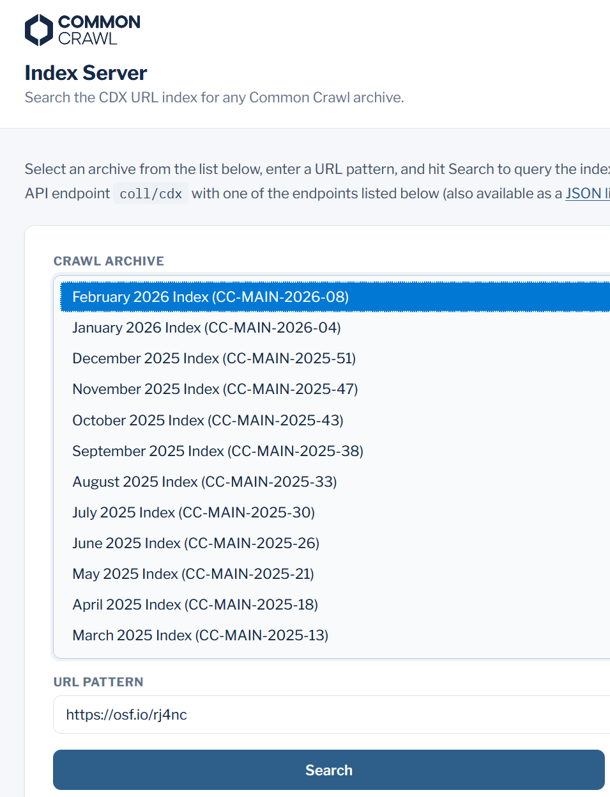{width="100%"}

:::
::::

---


## Study Design {.smaller}

**Existing data**

| Dataset | Language | Source | N words (approx.) |
|---|---|---|---|---|
| Glasgow Norms (human familiarity) | English | Scott et al. (2019) | 5,500
| GPT-4o-mini familiarity | English | Brysbaert, Martínez, & Reviriego (2024) | ~5,000
| LDT | English | Mandera et al. (2020) | ~62,000
| human + GPT-4o-mini familiarity | German | Conde et al. (2026) | ~11,000
| Word frequency and LDT | German | Brysbaert et al. (2011) | ~3,000, ~370,000
| LDT | German | Günther et al. (2020) | ~5,000
| LDT | German | Schroeder et al. (2015) | ~1,000
| LLM-based frequency | German, English | Schepens et al. (2025) | ~10,000


:::: {.columns}
::: {.column width="52%"}

**Regression modeling:**

- `log_rt`, with removed outliers `|z(log_rt)| <= 3` and `accuracy > 70%` 
- `Baseline`: `word_length`
- `Baseline`: `word_length` + `child_old20` + `aoa`
:::

::: {.column width="48%"}
**Final number of words:**

- English adults: `{python} analysis_rows_english`
- German adults: `{python} analysis_rows_german`
- German kids: `{python} analysis_rows_kids`
:::
::::

---

## Familiarity and Lexical Surprisal {.smaller}

**Familiarity**: "How familiar is this word to you?"

- `human_fam`: human familiarity norms (from Brysbaert et al., 2026 for German, Scott et al., 2019 for English)
- `gpt_fam`: based on GPT 4o / 4.1 mini using log-prob scoring (Brysbaert et al., 2024, Conde et al., 2026)
- `gptoss_fam`: using SAIA
- `apertus_fam`: using SAIA
- `olmo_fam`: base-model estimate using RAMSES, generated with log-prob scoring

*Log-prob scoring:* generate log-probabilities for the `1–7` rating scale, then compute the weighted mean. 

*Example*: $p_2 = .2,\; p_3 = .5,\; p_4 = .2 \;\Rightarrow\; \hat{r} = .2{\times}2 + .5{\times}3 + .2{\times}4 = 2.9$

$$\hat{r} = \sum_{k=1}^{7} k \cdot p_k$$


**Surprisal**: Represents the probability / predictability of a word given a fixed prompt. 

*Example*: German `abendbrot`: tokens `[" ab", "end", "brot"]`, logprobs `[-9.1, -6.0, -5.2]` -> surprisal `20.4` nats.

- Caveat: summed lexical surprisal is higher for longer / segmented words, so length/tokenization effect.

$$
S(w) = - \sum_{i=1}^{k} \log p(t_i \mid \text{prefix}, t_{<i})
$$


---

## Overview {.smaller .wide-figure-slide}

:::: {.columns}
::: {.column width="50%"}
**English**

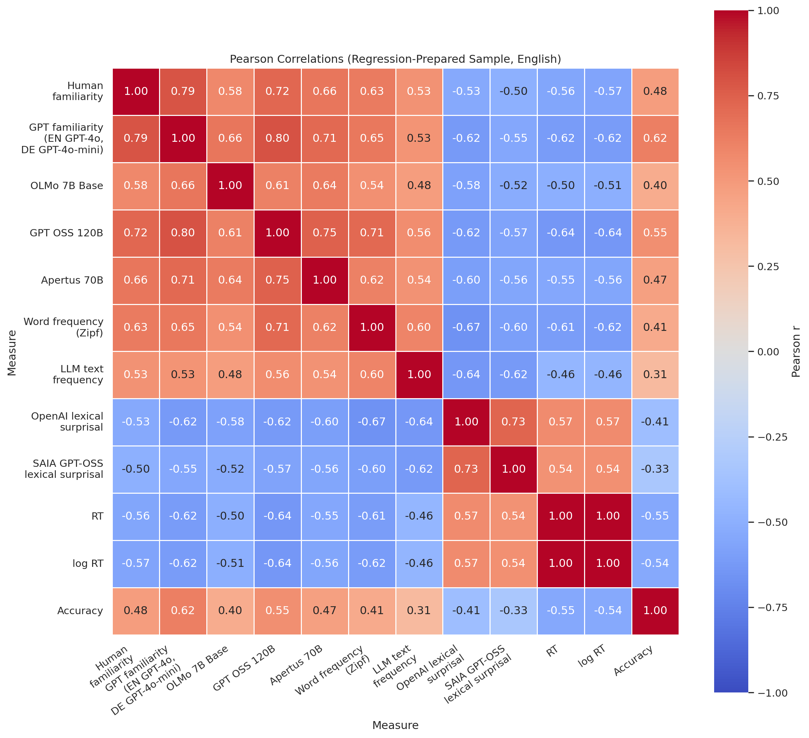{fig-alt="English pairwise familiarity and reference correlations in the regression-prepared sample" width="100%"}
:::
::: {.column width="50%"}
**German**

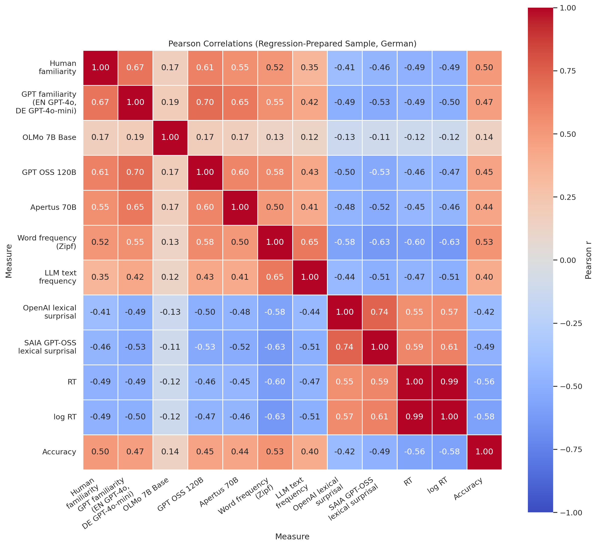{fig-alt="German pairwise familiarity and reference correlations in the regression-prepared sample" width="100%"}
:::
::::

---

## Word Frequency: Multilex vs (AI) Familiarity {.smaller .wide-figure-slide}

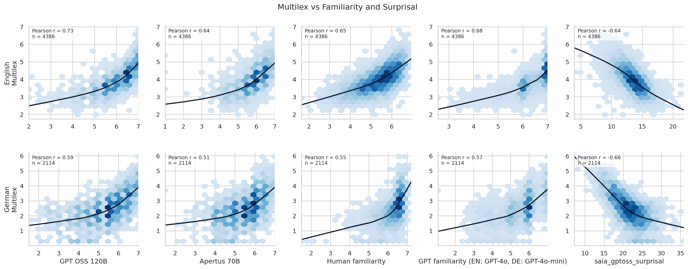{fig-alt="Multilex versus AI familiarity panel figure" width="100%"}

Non-linear pattern. Familiarity ratings are more compressed near the top. Frequency is more spread out and heavy-tailed.

---


## Processing Speed: RT vs (AI) Familiarity {.smaller .wide-figure-slide}

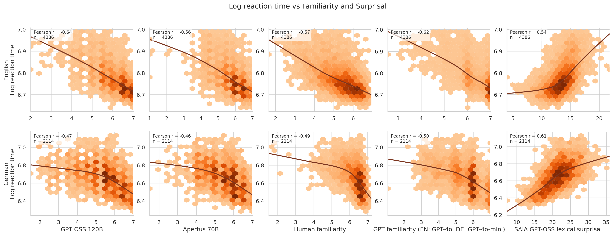{fig-alt="Log reaction time versus AI familiarity panel figure" width="100%"}

Different shapes, similar correlations. 

---

## Disagreement Examples {.smaller}

Examples of where the measures pull apart in informative ways:

:::: {.columns}
::: {.column width="50%"}
**Low human + High AI familiarity**

- English, GPT-OSS: `mall`
  Human `3.82`, GPT-OSS `6.80`
- English, OLMo: `edifice`
  Human `1.94`, OLMo `4.95`
- German, GPT-OSS: `kirchhof`
  Human `4.94`, GPT-OSS `6.50`
:::

::: {.column width="50%"}
**High AI familiarity + high AI surprisal**

- English, GPT-4 familiarity: `vomit`
  GPT-4 fam `6.73`, surprisal `19.00`
- English, GPT-OSS familiarity: `ticklish`
  GPT-OSS fam `6.00`, surprisal `20.87`
- German, GPT-4 familiarity: `kuhmilch`
  GPT-4 fam `7.00`, surprisal `32.65`
- German, GPT-OSS familiarity: `kakaobohne`
  GPT-OSS fam `6.00`, surprisal `36.30`
:::
::::

:::: {.columns}
::: {.column width="50%"}
**High human + low AI familiarity**

- German, GPT-OSS: `wegrand`
  Human `6.41`, GPT-OSS `1.50`
:::

::: {.column width="50%"}
**High frequency + high surprisal**

- English: `seduce`
  Multilex `3.70`, surprisal `20.10`
- English: `grandpa`
  Multilex `4.56`, surprisal `17.06`
- German: `sektglas`
  Multilex `1.41`, surprisal `36.99`
:::
::::

---

## Adult Model Comparison {.smaller}

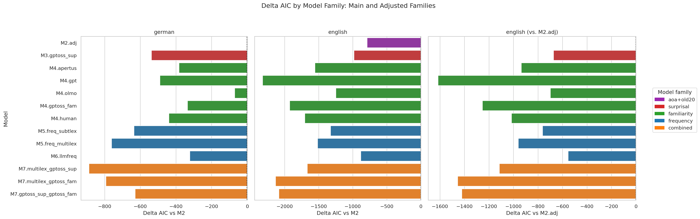{fig-alt="Adult delta AIC comparison plot" width="95%"}

- Language and model-specific effects. No clear frequency vs familiarity vs surprisal patterns.

---


## German Kids: Similar Pattern {.smaller}

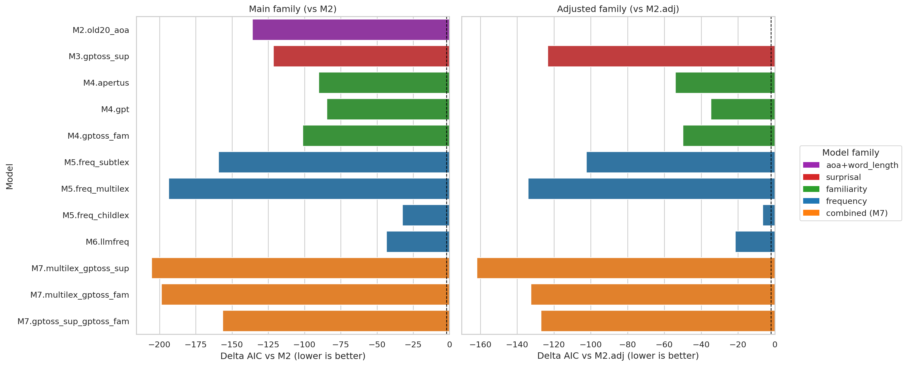{fig-alt="German kids delta AIC vs M2" width="95%"}

Not enough human familarity ratings available (<100)

---


## Adults vs Kids {.smaller}

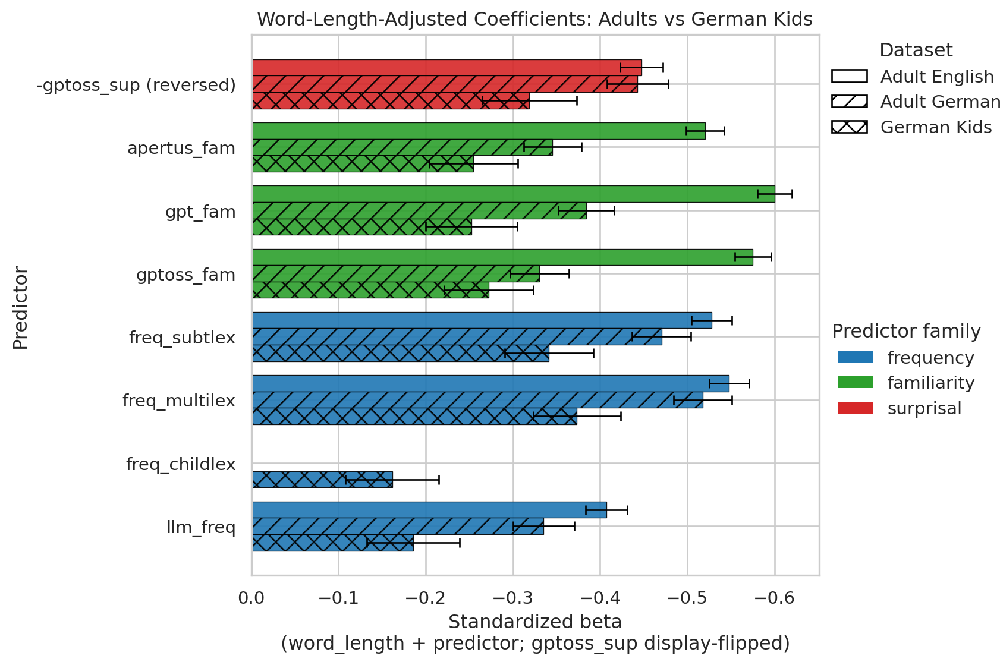{fig-alt="Adults vs kids standardized effect comparison" width="92%"}


- Predictors remain directionally consistent 
- Relative balance between frequency and familiarity differs
- The adult signal seems clearest

---

## Summary and Future Work

:::: {.columns}
::: {.column width="52%"}

Summary:

- LLM-derived familiarity is not a single construct; different model families behave differently.
- Familiarity, surprisal, and frequency capture overlapping and non-identical parts of RTs.

::: 

::: {.column width="52%"}

Future work:

- Multilingual logprobs-based familiarity and surprisal using a base model with open training data
- Compare effects across more words (not only the human familiarity norms) 
- Include more German lexical decision data 
:::
::::

---

## References {.tiny}

- Brysbaert, M., Martinez, G., & Reviriego, P. (2024). Moving beyond word frequency based on tally counting: AI-generated familiarity estimates of words and phrases are an interesting additional index of language knowledge. *Behavior Research Methods, 56*, 3180-3199. https://doi.org/10.3758/s13428-024-02561-7
- Brysbaert, M., Mandera, P., McCormick, S. F., & Keuleers, E. (2019). Word prevalence norms for 62,000 English lemmas. *Behavior Research Methods, 51*, 467-479. https://doi.org/10.3758/s13428-018-1077-9
- Brysbaert, M., & New, B. (2009). Moving beyond Kucera and Francis: A critical evaluation of current word frequency norms and the introduction of a new and improved word frequency measure for American English. *Behavior Research Methods, 41*(4), 977-990. https://doi.org/10.3758/BRM.41.4.977
- Brysbaert, M., Buchmeier, M., Conrad, M., Jacobs, A. M., Bolte, J., & Bohl, A. (2011). The word frequency effect: A review of recent developments and implications for the choice of frequency estimates in German. *Experimental Psychology, 58*(5), 412-424. https://doi.org/10.1027/1618-3169/a000123
- Conde, J., Martinez, G., Grandury, M., Arriaga, C., Haro, J., Schroeder, S., Hintz, F., Reviriego, P., & Brysbaert, M. (2026). Updating the German Psycholinguistic Word Toolbox with AI-generated estimates of concreteness, valence, arousal, age of acquisition, and familiarity. *Journal of Cognition, 9*(1), 9. https://doi.org/10.5334/joc.482
- Guenther, F., Marelli, M., & Boelte, J. (2020). Semantic transparency effects in German compounds: A large dataset and multiple-task investigation. *Behavior Research Methods, 52*(3), 1208-1224. https://doi.org/10.3758/s13428-019-01311-4
- Mandera, P., Keuleers, E., & Brysbaert, M. (2020). Recognition times for 62 thousand English words: Data from the English Crowdsourcing Project. *Behavior Research Methods, 52*(2), 741-760. https://doi.org/10.3758/s13428-019-01272-8
- Schepens, J., Woloszyn, H., Marx, N., Gagl, B. (2025). Can large language models generate useful linguistic corpora? *Open Mind, 9*. https://doi.org/10.1162/OPMI.a.30
- Schroeder, S., Wuerzner, K. M., Heister, J., Geyken, A., & Kliegl, R. (2015). childLex: A lexical database of German read by children. *Behavior Research Methods, 47*(4), 1085-1094. https://doi.org/10.3758/s13428-014-0528-1
- Scott, G. G., Keitel, A., Becirspahic, M., Yao, B., & Sereno, S. C. (2019). The Glasgow Norms: Ratings of 5,500 words on nine scales. *Behavior Research Methods, 51*, 1258-1270. https://doi.org/10.3758/s13428-018-1099-3
- Team OLMo, Ettinger, A., et al. (2025). *OLMo 3* [Preprint]. arXiv. https://arxiv.org/abs/2512.13961

---

## Backup: Methods Notes {.smaller}

- `analysis_rows` are the final regression sample after RT filtering, outlier exclusion, and listwise requirements for the fit-capable model family.
- OLMo-3 was used for logprobs because base-model probabilities are more interpretable than instruction-tuned next-token distributions for rating extraction.
- SAIA supported both chat and completion-style endpoints in our environment; KI:Connect supported chat, but not completion-style scoring.
- Adults diagnostics source: `r adult_result_stamp`
- Kids diagnostics source: `r kids_result_stamp`


## Surprisal Panels: GPT-OSS vs AI Familiarity {.smaller}

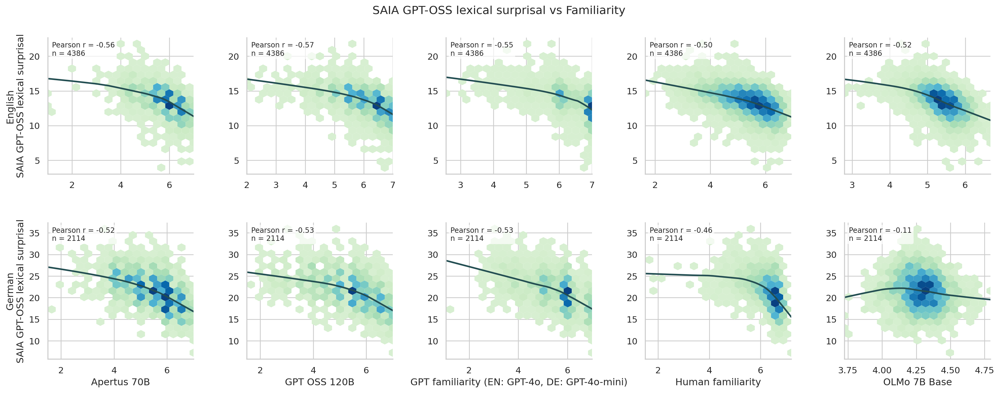{fig-alt="SAIA GPT-OSS surprisal versus AI familiarity panel figure" width="100%"}

- surprisal and familiarity are related, but in the opposite direction

---


## Adult Single-Predictor Effects {.smaller}

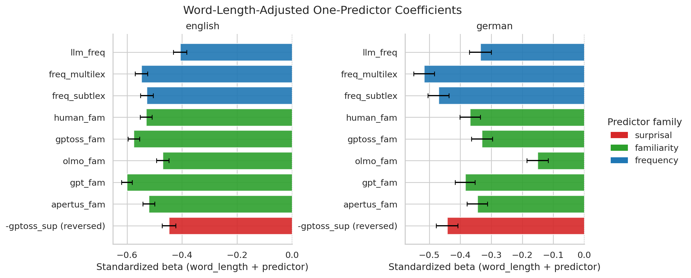{fig-alt="Word-length-only standardized coefficients" width="95%"}

---


## Adults vs Kids With Extra Controls {.smaller}

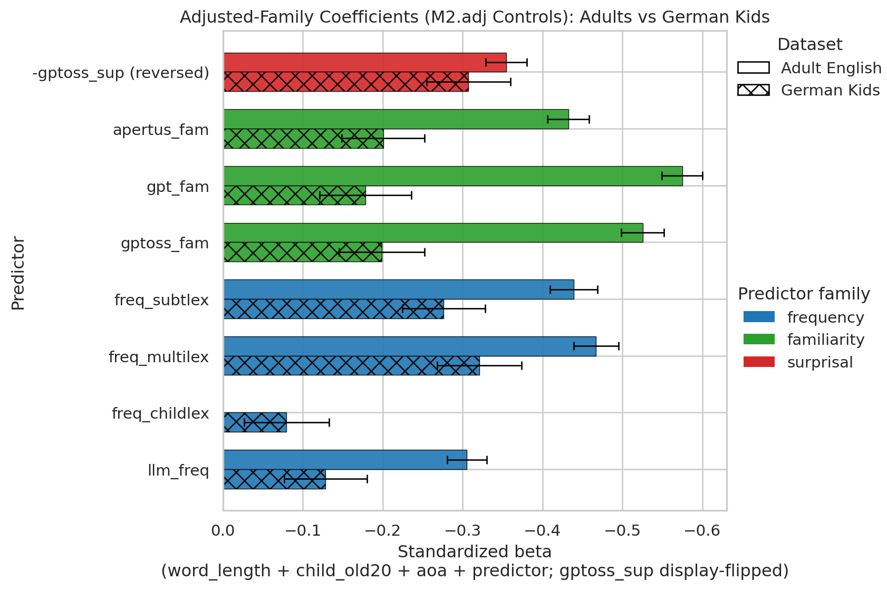{fig-alt="Adults vs kids adjusted-model standardized effect comparison" width="92%"}

- Adding `old20` and `aoa` is a harder test.
- The core pattern does not disappear.
- familiarity/frequency/surprisal effects are not just proxies for orthographic structure or acquisition age.

---
